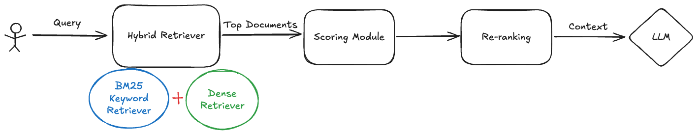

# RagEngine

**RagEngine** is a modular, extensible framework for building Retrieval-Augmented Generation (RAG) pipelines. It combines sparse (BM25) and dense (vector) retrieval techniques to fetch relevant documents and generate grounded answers using large language models (LLMs). This powerful framework enables developers to build and deploy RAG pipelines, providing a robust solution for retrieving relevant documents and generating accurate responses. The modular architecture allows for easy customization and extension, making it suitable for both educational purposes and production environments.

This project is designed to:
- Serve as a learning resource for hybrid retrieval and RAG
- Act as a practical base for local or remote LLM deployments
- Support plug-and-play retrievers, scoring logic, and generation backends

## 🧭 System Architecture



### 🔧 Features
- ✅ BM25-based sparse retrieval using `rank_bm25`
- ✅ Dense vector search using SentenceTransformers + Faiss
- ✅ Hybrid scoring combiner (weighted, rank fusion, etc.)
- ✅ LLM-ready response pipeline (for future integration)
- ✅ Modular design for swapping components

## 🔹 How to Run the App

To run the RagEngine application, follow these steps:

1. **Clone the Repository:**
   ```bash
   git clone https://github.com/iamiranjbar/RagEngine.git
   cd RagEngine
   ```
2. **(Recommended) Create a Virtual Environment:**
   ```bash
   python -m venv .venv
   source .venv/bin/activate
   ```

3. **Install Dependencies:**
   ```bash
   pip install -r requirements.txt
   ```

4. **Run the Application:**

   - **Option 1: Run the CLI**
     ```bash
     python cli.py
     ```
     Interact with RagEngine via the command-line interface.

   - **Option 2: Run the UI**
     ```bash
     streamlit run app.py
     ```
     Interact with RagEngine via the graphical user interface (GUI).


## 🔹 File/Folder Structure

```
RagEngine/
│
├── app.py                  # Streamlit web application
├── cli.py                  # Command-line interface
├── requirements.txt        # Project dependencies
├── feedback.json          # Feedback data for hybrid retrieval
├── retrievers/            # Retrieval implementations
│   ├── __init__.py
│   ├── bm25_retriever.py  # BM25-based sparse retrieval
│   ├── dense_retriever.py # Vector-based dense retrieval
│   ├── hybrid_retriever.py # Combined retrieval approach
│   └── hybrid_feedback_retriever.py # Feedback-based hybrid retrieval
│
├── utils/                 # Utility functions
│   ├── __init__.py
│   ├── loader.py         # Data loading utilities
│   └── preprocessor.py   # Text preprocessing utilities
│
├── data/                 # Data directory for documents and embeddings
│
└── README.md            # Project documentation
```

If you have any questions or need further assistance, feel free to ask!
